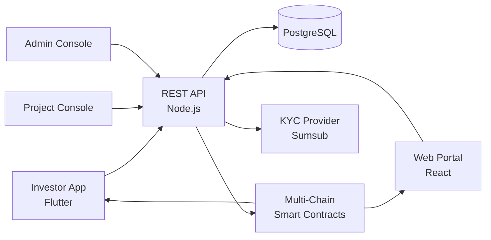

# Pinksale Clone — White-Label Crypto IDO Launchpad & Token Sale Platform by Miracuves

**MXIco** is a production-ready, white-label Pinksale clone: a complete IDO launchpad with staking, tier allocation, vesting, and admin console — delivered with **100% source code ownership** in **6 working days**.

> 🚀 **See it running before you talk to anyone.** Live investor app, project dashboard, and admin console — demo credentials are printed on the [solution page](https://miracuves.com/pinksale-clone#demo). No sales call required.

---

## 🚀 Live Demos

| Environment | URL | What you can test |
|---|---|---|
| 📱 Investor App | [mas.mimeld.com](https://mas.mimeld.com) | Browse IDOs, stake, allocate, claim tokens |
| 🌐 Web Portal | [mxico.mimeld.com](https://mxico.mimeld.com) | Full IDO dashboard in the browser |
| 🚀 Project Console | [Solution page → Demo](https://miracuves.com/pinksale-clone#demo) | Submit project, set tiers, track allocations |
| 🛠️ Admin Console | [Solution page → Demo](https://miracuves.com/pinksale-clone#demo) | Projects, pools, KYC, vesting, analytics |

Demo credentials for all environments: **[miracuves.com/pinksale-clone → Demo section](https://miracuves.com/pinksale-clone/#demo)**

---

## ✨ What Makes This Pinksale Clone Different

Most launchpad scripts stop at "tier + claim." This platform ships with the features that actually run a token-sale *business*:

- **Tier-Based Allocation** — stake-platform-token → get tier → get allocation — same mechanics that BSCPad and Polkastarter built on
- **Multi-Chain Pools** — 
- **Automated Vesting** — BSC, Ethereum, Polygon, Solana, Base — one codebase deploys to all
- **Anti-Bot Protection** — integrated KYC providers so projects can pass jurisdictional checks without leaving the platform
- **KYC-as-a-Service** — wallet-level checks, CAPTCHA, queue-based allocation to neutralize bot snipes

## 📦 Core Features

**Investor:** IDO discovery · staking pools · tier system · allocation calculator · claim tokens · vesting tracker · portfolio · referral

**Project (Issuer):** project submission · tokenomics design · tier structure · whitepaper upload · KYC & audit · vesting schedule · distribution tracker

**Admin:** project approvals · pool configuration · KYC verification · vesting schedules · audit log · analytics reports

## 🏗️ Architecture

**Stack:** Node.js backend · Solidity smart contracts (audit-ready) · React/Next.js for web · React Native / Flutter for mobile · PostgreSQL + TheGraph for indexed data · crypto-native; ETH, BSC, MATIC, SOL, USDC, USDT support

## 📋 What’s Included

- ✅ Full source code — backend, web, mobile apps, panels (no encryption, no license locks)
- ✅ Deployment to your servers & app store submission assistance
- ✅ Your branding — white-label rename, logo, colors, domain
- ✅ 60 days post-launch support + 12 months of free updates
- ✅ Documentation & handover

**Pricing:** from **$3,099**, transparent on the [solution page](https://miracuves.com/pinksale-clone/#pricing) — no "contact us for quote" games.

## 🆚 Why Not Build From Scratch?

Custom IDO launchpads run $100k–$500k and 4–9 months. A proven white-label base gets you to market in 6 working days for a fraction of that, with your budget preserved for audit fees and project marketing.

## 📚 Resources

- 📖 [Pinksale Clone — Full Solution Page](https://miracuves.com/pinksale-clone) (features, pricing, demos, FAQ)
- 💰 [How Much Does a Crypto Launchpad Cost in 2026?](https://miracuves.com/pinksale-clone#pricing) pricing breakdown & what's included
- 📝 [Best Pinksale Clone Script in 2026](https://miracuves.com/pinksale-clone/blog/) features, pricing & launch guide
- 🧠 [Tier-Based Allocation Mechanics Explained](https://miracuves.com/pinksale-clone/blog/) staking, tiers, anti-bot math
- ✅ [Miracuves Facts & Claims Ledger](https://miracuves.com/pinksale-clone/facts/) every claim we make, verified

## 🏢 About Miracuves

[Miracuves Solutions](https://miracuves.com) builds white-label clone apps and custom software from Mumbai, India — 90+ ready-made solutions, live demos for every product, transparent pricing, and delivery in 6 working days. Operating since 2010.

**Talk to us:** [WhatsApp](https://wa.me/919830009649) · [Schedule a consultation](https://miracuves.com/schedule-consultation/) · [miracuves.com](https://miracuves.com)

---

### ⚠️ Note on This Repository

This repository is a product overview. The full source code is delivered to clients on purchase — see [what’s included](https://miracuves.com/pinksale-clone/#included). For a hands-on evaluation, use the live demos above; credentials are public on the solution page.

*Keywords: pinksale clone, pinksale clone script, IDO launchpad, token sale, white label launchpad, BSCPad, Polkastarter, Flutter IDO app, Node.js launchpad*

---

<!--
══════════════════════════════════════════════════
TEMPLATE VARIABLE KEY — auto-generated from Netflix-Clone pattern
══════════════════════════════════════════════════
{APP_NAME}        Pinksale Clone
{MX_NAME}         MXIco
{CATEGORY}        Crypto IDO Launchpad & Token Sale Platform
{DEMO_WEB}        mxico.mimeld.com
{PRICE}           $3,099
{SLUG}            pinksale-clone
{SOLUTION_URL}    https://miracuves.com/pinksale-clone/
{VERTICAL}        crypto_launchpad

See /tmp/verticals/crypto_launchpad.txt for the vertical config used to generate this README.
══════════════════════════════════════════════════
-->